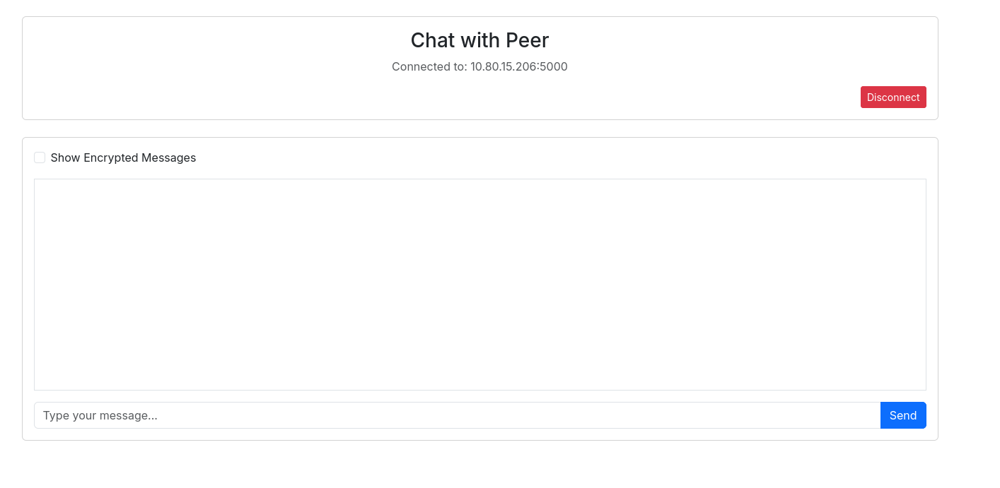

# Relatório Técnico – Assimetric-Connect: Chat P2P com Criptografia RSA

## 1. Visão Geral

O **Assimetric-Connect** é um sistema de chat peer-to-peer (P2P) que utiliza criptografia RSA para proteger as mensagens em trânsito. Cada instância da aplicação opera simultaneamente como cliente e servidor, eliminando a necessidade de um servidor centralizado. A troca de chaves públicas ocorre no momento da conexão, e toda mensagem subsequente é cifrada com RSA-OAEP antes do envio.

O projeto foi desenvolvido em **Python** com **Flask** e **Flask-SocketIO**, utilizando a biblioteca `cryptography` para as operações criptográficas.

---

## 2. Arquitetura do Sistema

A aplicação segue um modelo **P2P híbrido**: cada peer executa um servidor Flask (HTTP + WebSocket) e se comunica com outros peers via requisições HTTP POST (webhooks).

```
┌────────────────────────────────────────────────────┐
│                   PEER A (IP:5000)                 │
│  ┌──────────┐   ┌───────────────┐   ┌───────────┐  │
│  │ Browser  │◄─►│ Flask +       │◄─►│ security  │  │
│  │ (UI)     │   │ SocketIO      │   │ (RSA)     │  │
│  └──────────┘   └───────┬───────┘   └───────────┘  │
└─────────────────────────┼──────────────────────────┘
                          │ HTTP POST (webhooks)
                          ▼
┌─────────────────────────┼──────────────────────────┐
│                   PEER B (IP:5000)                 │
│  ┌──────────┐   ┌───────┴───────┐   ┌───────────┐  │
│  │ Browser  │◄─►│ Flask +       │◄─►│ security  │  │
│  │ (UI)     │   │ SocketIO      │   │ (RSA)     │  │
│  └──────────┘   └───────────────┘   └───────────┘  |
└────────────────────────────────────────────────────┘
```

**Camadas de comunicação:**

| Camada | Tecnologia | Função |
|--------|-----------|--------|
| UI ↔ Servidor local | WebSocket (Socket.IO) | Eventos em tempo real (enviar msg, notificações) |
| Servidor ↔ Servidor | HTTP POST (webhooks) | Troca de chaves, mensagens cifradas, controle de conexão |

---

## 3. Stack Tecnológica

| Componente | Tecnologia |
|-----------|-----------|
| Backend | Python 3.12, Flask, Flask-SocketIO, eventlet |
| Criptografia | `cryptography` (RSA, OAEP, SHA-256) |
| Comunicação inter-peer | `requests` (HTTP POST) |
| Frontend | HTML, Bootstrap 5, jQuery, Socket.IO client, SweetAlert2 |
| Deploy | Docker / Docker Compose (`network_mode: host`) |

---

## 4. Parâmetros Criptográficos

O módulo `security.py` implementa as seguintes operações:

| Parâmetro | Valor |
|----------|-------|
| Algoritmo | RSA |
| Tamanho da chave | 2048 bits |
| Expoente público | 65537 (F4) |
| Padding | OAEP |
| Função hash (OAEP) | SHA-256 |
| MGF | MGF1 com SHA-256 |
| Formato da chave privada | PKCS8, PEM, sem cifragem |
| Formato da chave pública | SubjectPublicKeyInfo, PEM |
| Codificação do ciphertext | Base64 (para transporte em JSON) |

### Geração de chaves

Na inicialização, o sistema gera um par de chaves RSA-2048 e armazena os arquivos PEM no diretório `keys/`:

```
keys/
├── private.pem      # Chave privada (nunca transmitida)
├── public.pem       # Chave pública própria
└── <peer_ip>.pem    # Chave pública de cada peer conectado
```

### Cifragem e decifragem

A cifragem utiliza **RSA-OAEP** com MGF1/SHA-256. O texto claro é cifrado com a chave pública do destinatário, codificado em Base64, e enviado via HTTP POST. O destinatário decodifica o Base64, decifra com sua chave privada usando os mesmos parâmetros de padding, e obtém o texto original.

> **Limitação:** como o RSA-OAEP com chave de 2048 bits suporta no máximo ~190 bytes de plaintext por operação, o sistema é adequado para mensagens curtas. Para mensagens maiores, seria necessário um esquema híbrido (ex.: AES + RSA).

---

## 5. Protocolo de Conexão

O handshake entre dois peers segue o seguinte fluxo:

```
   Peer A                                         Peer B
     │                                               │
     │  1. POST /webhook/connect_request             │
     │   { from_ip, to_ip }                          │
     │──────────────────────────────────────────────►│
     │                                               │
     │              2. UI exibe SweetAlert           │
     │              (aceitar / recusar)              │
     │                                               │
     │  3. POST /webhook/connect_confirm             │
     │   { allow: true, public_key: PEM_B, from_ip } │
     │◄──────────────────────────────────────────────│
     │                                               │
     │  4. Response 200                              │
     │   { public_key: PEM_A }                       │
     │──────────────────────────────────────────────►│
     │                                               │
     │  ══ Chaves trocadas, chat habilitado ══       │
     │                                               │
```

1. **Peer A** envia um `connect_request` via webhook contendo seu IP.
2. **Peer B** recebe a solicitação e exibe um alerta interativo ao usuário.
3. Se aceito, **Peer B** envia sua chave pública no `connect_confirm`.
4. **Peer A** responde com sua própria chave pública no corpo da resposta HTTP.
5. Ambos armazenam a chave pública do outro em `keys/<ip>.pem` e são redirecionados para a interface de chat.

---

## 6. Protocolo de Mensagens

Após a troca de chaves, o envio de mensagens segue este fluxo:

```
   Peer A (remetente)                              Peer B (destinatário)
     │                                               │
     │  1. Usuário digita mensagem M                 │
     │  2. C = RSA_OAEP_Encrypt(M, PubKey_B)         │
     │  3. C_b64 = Base64(C)                         │
     │                                               │
     │  4. POST /webhook/receive_message             │
     │   { message: C_b64, from_ip }                 │
     │──────────────────────────────────────────────►│
     │                                               │
     │                5. C = Base64_Decode(C_b64)    │
     │                6. M = RSA_OAEP_Decrypt(C,     │
     │                        PrivKey_B)             │
     │                7. Exibe M no chat             │
     │                                               │
```

### Endpoints (Webhooks)

| Rota | Método | Descrição |
|------|--------|-----------|
| `/webhook/connect_request` | POST | Solicitar conexão a um peer |
| `/webhook/connect_confirm` | POST | Confirmar/rejeitar conexão e trocar chaves |
| `/webhook/receive_message` | POST | Receber mensagem cifrada |
| `/webhook/disconnect` | POST | Notificar desconexão |

### Eventos SocketIO

| Evento | Direção | Função |
|--------|---------|--------|
| `connect_to_peer` | Cliente → Servidor | Iniciar conexão com peer |
| `connect_confirmation` | Cliente → Servidor | Aceitar/rejeitar convite |
| `chat_send_message` | Cliente → Servidor | Enviar mensagem |
| `connect_request` | Servidor → Cliente | Notificar convite recebido |
| `goto_chat` | Servidor → Cliente | Redirecionar para tela de chat |
| `chat_receive_message` | Servidor → Cliente | Entregar mensagem decifrada |

---

## 7. Interface e Execução

### Chat conectado — interface vazia

Após a conexão ser estabelecida e as chaves trocadas, o usuário é redirecionado para a tela de chat. A interface exibe o IP do peer conectado e um checkbox para visualizar as mensagens cifradas.



*A interface exibe o endereço do peer (10.80.15.206:5000), o botão de desconexão, o checkbox "Show Encrypted Messages" e o campo de entrada de mensagens.*

---

### Troca de mensagens em texto claro

As mensagens são exibidas com alinhamento visual de acordo com o remetente: mensagens recebidas à esquerda (cinza) e mensagens enviadas à direita (verde).


*Mensagens recebidas ("teste aaa", "mande mensagens") exibidas à esquerda. Mensagem enviada ("MEnsagean") à direita. Toda a cifragem/decifragem ocorre de forma transparente ao usuário.*

---

### Visualização do ciphertext (RSA-OAEP)

Ao ativar o checkbox **"Show Encrypted Messages"**, o sistema exibe o ciphertext em Base64 que foi efetivamente transmitido pela rede. Isso permite verificar que os dados em trânsito são ilegíveis sem a chave privada correspondente.


*Com o checkbox ativado, o bloco cinza exibe o ciphertext RSA-OAEP codificado em Base64. Abaixo, as mensagens em texto claro ("aaaaaaaaaaa", "legal") continuam visíveis após a decifragem local.*

---

## 8. Deploy

O sistema suporta execução local e via Docker:

**Execução local:**
```bash
python app.py              # porta 5000 (padrão)
python app.py --port 5001  # porta alternativa
```

**Docker Compose (instância única):**
```bash
docker compose up
```

**Simulação de dois peers (mesmo host):**
```bash
docker compose -f two_peer_simulation.yml up
```

O `docker-compose.yml` utiliza `network_mode: host` para que os containers acessem a rede local diretamente, permitindo a descoberta por IP entre peers.

---

## 9. Considerações de Segurança

| Aspecto | Estado atual | Melhoria possível |
|---------|-------------|-------------------|
| Confidencialidade | RSA-OAEP 2048-bit com SHA-256 | Esquema híbrido (AES-256-GCM + RSA para key wrap) |
| Autenticação do peer | Nenhuma (confia no IP) | Assinatura digital das mensagens com chave privada |
| Integridade | Garantida pelo OAEP (detecção de tampering) | HMAC adicional ou uso de AEAD |
| Forward secrecy | Não presente (mesmas chaves RSA por sessão) | ECDHE para chaves de sessão efêmeras |
| Armazenamento de chaves | PEM sem cifragem em disco | Cifrar chave privada com passphrase (PKCS8 + scrypt) |
| Tamanho de mensagem | Limitado a ~190 bytes (RSA direto) | Cifragem híbrida para payload arbitrário |
| Transporte | HTTP plaintext entre peers | TLS mútuo (mTLS) para o canal de transporte |

---

## 10. Conclusão

O Assimetric-Connect demonstra uma implementação funcional de comunicação P2P com criptografia assimétrica. O sistema implementa o ciclo completo: geração de chaves RSA-2048, troca de chaves públicas via protocolo de handshake HTTP, cifragem RSA-OAEP com SHA-256, e decifragem local com a chave privada — tudo integrado a uma interface web em tempo real via WebSockets.

A arquitetura sem servidor central evidencia como dois nós podem estabelecer comunicação segura usando apenas criptografia de chave pública, seguindo o mesmo princípio fundamental do TLS handshake. As limitações identificadas (ausência de forward secrecy, cifragem direta sem esquema híbrido, transporte HTTP sem TLS) apontam caminhos naturais de evolução para um sistema de produção.
